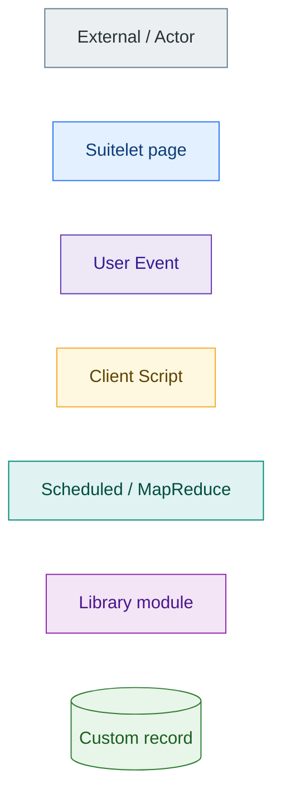
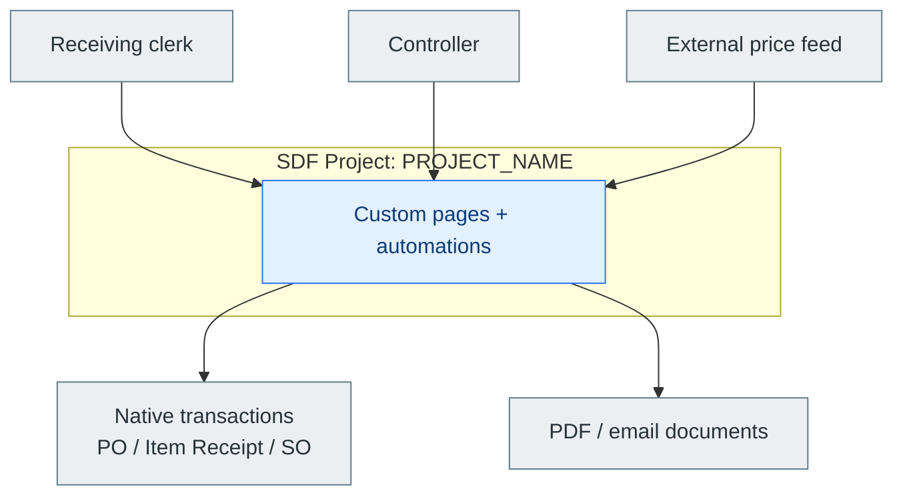
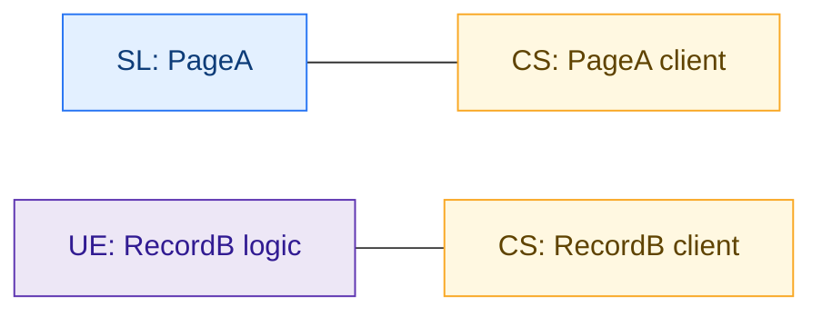
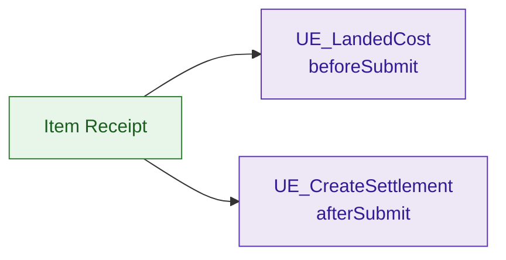
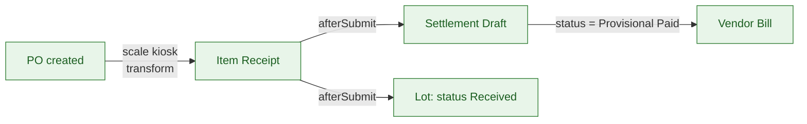
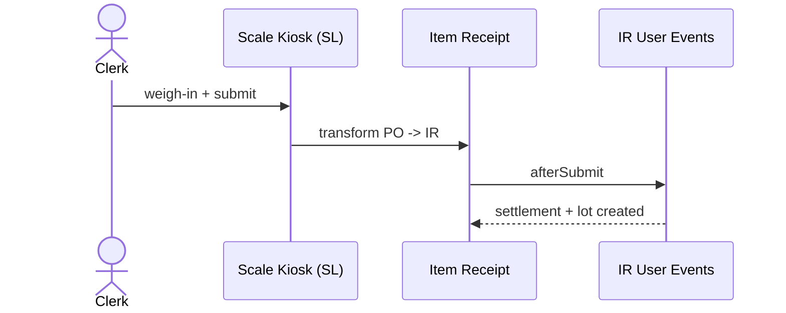
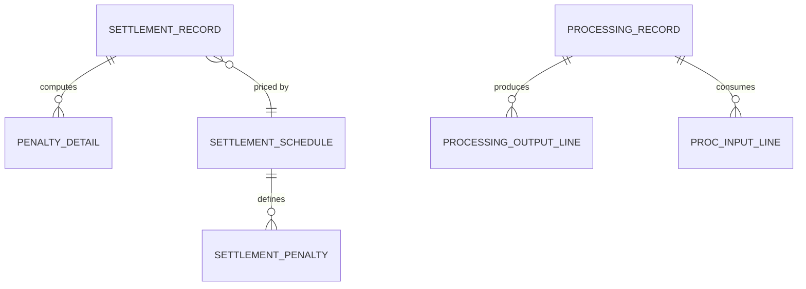
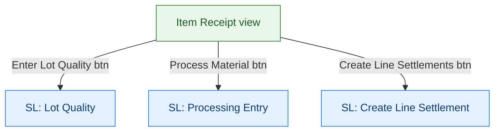
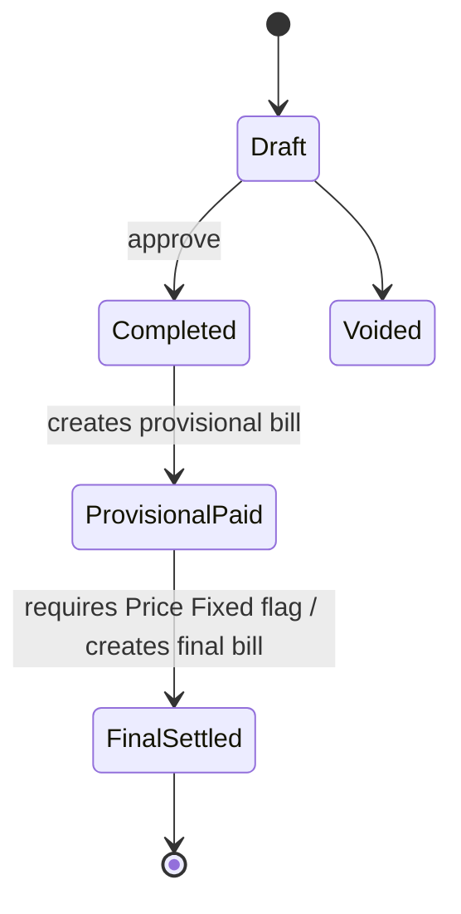

# Mermaid patterns for NetSuite SDF architecture diagrams

Copy-ready templates for the six standard diagrams. Replace the placeholder labels
with the real scriptids/record types you found in `src/Objects/*.xml` and the
`@NScriptType` tags in the SuiteScript files. Keep the `classDef` block identical
across diagrams so a Suitelet always looks like a Suitelet.

## Shared class definitions

Paste this `classDef` set into any `graph`/`flowchart` diagram for a consistent palette.
Colors are brand-neutral; swap the Suitelet accent for the org brand color if desired
(Myers-Holum / company blue: `#2976F3`).

## 1. System context (`graph TB`)

Project as one box; actors and external systems around it.

## 2. Script inventory by type

Lead with a table, then a small graph pairing Client Scripts to their pages.

| Script (scriptid) | File | Type | Deployed on | Entry points |
|---|---|---|---|---|
| customscript_x | X.js | SUITELET | n/a | onRequest |
| customscript_y | Y.js | USEREVENTSCRIPT | Item Receipt | beforeLoad, afterSubmit |

## 3. User Event trigger matrix

Table first (authoritative, from deployment XML), then the record→UE graph.

| UE script | Record type | beforeLoad | beforeSubmit | afterSubmit |
|---|---|:--:|:--:|:--:|
| customscript_ue_x | Item Receipt | ✓ |  | ✓ |

## 4. End-to-end data flow (`flowchart LR`)

Annotate each edge with the trigger. Keep side effects on the node label.

For time-ordered automation with several actors, a `sequenceDiagram` reads better:

## 5. Custom-record ERD (`erDiagram`)

One line of role per entity in the trailing comment or the surrounding prose.

## 6. Page / screen map (`graph TB`)

Nodes = pages (Suitelets) and decorated native forms. Edges = the button/link that
navigates from one to the next.

## Optional: status state machine (`stateDiagram-v2`)

Use for a status field with guarded transitions and side effects.

## Parser gotchas (learned the hard way)

- Parentheses inside a node label break the parser. Write `Item Receipt view` not
  `Item Receipt (view)`. Put parenthetical detail in the prose caption instead.
- Avoid raw `%`, `&`, `<`, `>`, and quotes inside labels. Use ` ` for wraps.
- `erDiagram` entity names cannot contain spaces — use `SNAKE_CASE` and map them to
  real record-type ids in a table beneath the diagram.
- Keep one `classDef` block per diagram (Mermaid does not share them across fences).
