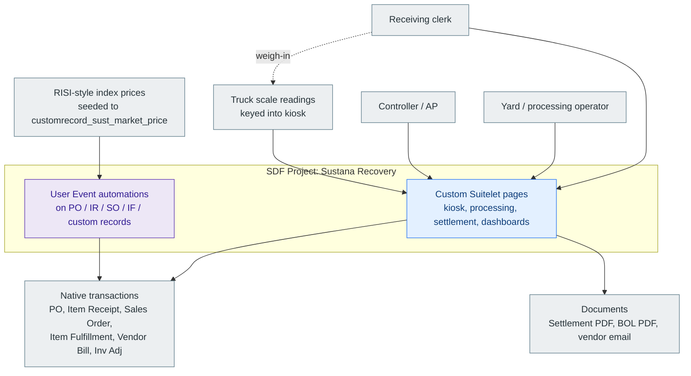
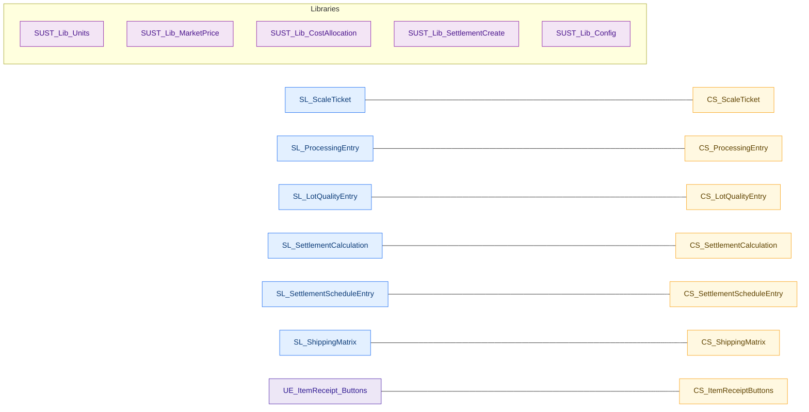
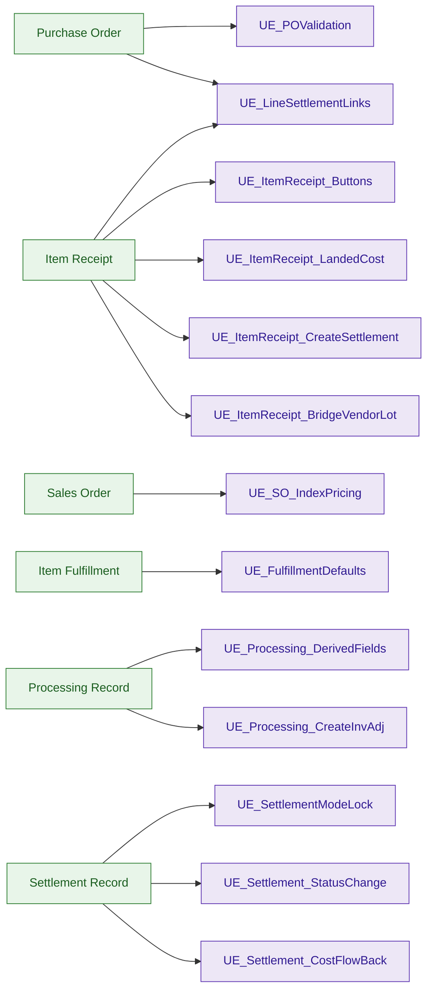
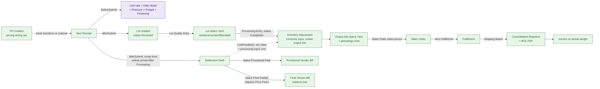
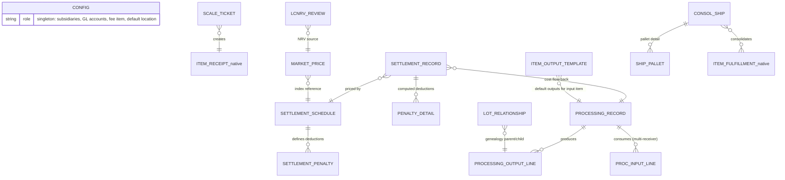
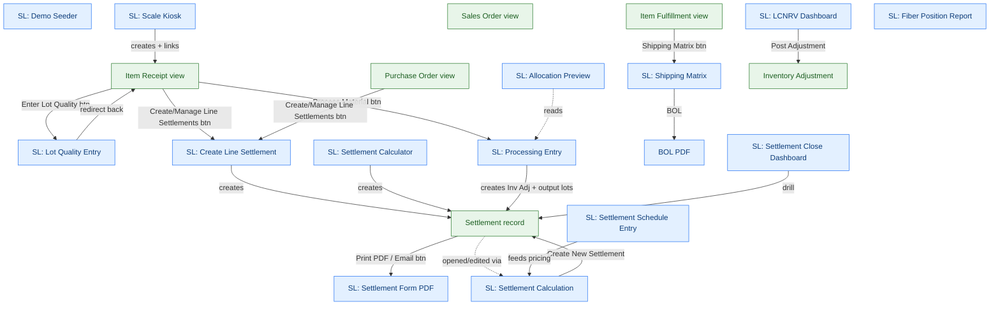
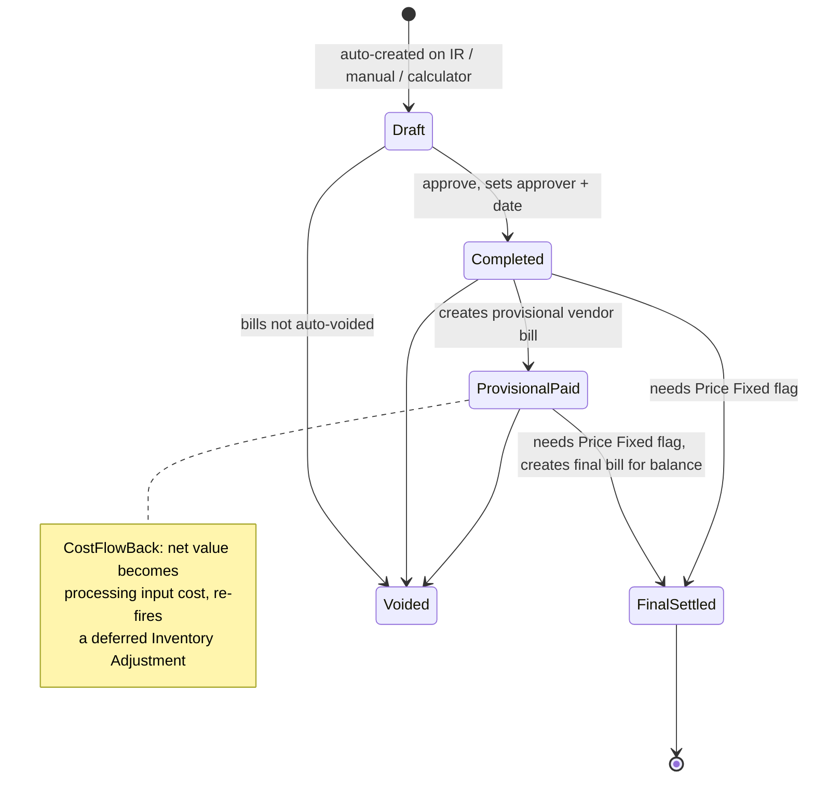
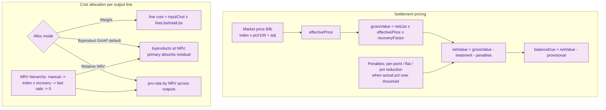

# Sustana Recovery — Architecture

Architecture diagrams for the **Sustana Recovery** NetSuite SDF Account
Customization Project (paper/fiber recovery: intake → process → price → settle).

Generated by static analysis of `manifest.xml`, `deploy.xml`, `src/Objects/*.xml`
(the deployment records are the source of truth for what fires on which record type),
and the SuiteScript under `src/FileCabinet/SuiteScripts/Sustana/`. No scripts were
executed and no account was queried. To regenerate, invoke the
`netsuite-sdf-architecture-diagrams` skill (see [.claude/skills](../.claude/skills/netsuite-sdf-architecture-diagrams/SKILL.md)).

All diagrams below are Mermaid and render on GitHub. Class colors are consistent across
diagrams: Suitelet = blue, User Event = purple, Client Script = amber, Scheduled = teal,
Library = magenta, Record = green.

---

## 1. System context

Sustana is an SDF customization layered on top of native NetSuite procurement, inventory,
and order-to-cash. Its custom Suitelets are the "pages" clerks and controllers work in;
its User Event scripts decorate native transactions (PO, Item Receipt, Sales Order, Item
Fulfillment) so that receiving, pricing, settlement, and lot genealogy happen with no
re-keying. Money and weight are stored in **pounds / $-per-lb**; tons and $/ton appear
only at UI and PDF edges. Index prices come from RISI-style published values seeded into
a custom record.



---

## 2. Script inventory by type

40 SuiteScript files: 14 Suitelets (pages), 13 User Events, 7 Client Scripts, 1 Scheduled
script, 5 Libraries. Libraries hold the shared math (units, market price, cost allocation,
settlement creation, config). Every interactive Suitelet with client-side validation has a
paired `SUST_CS_*` Client Script.



**Suitelets (pages)** — see [PAGES.md](PAGES.md) for what each renders:

| # | Suitelet | scriptid | Role |
|---|---|---|---|
| 1 | Scale Kiosk | `customscript_sust_sl_scaleticket` | Weigh-in → PO→IR transform |
| 2 | Lot Quality & Grade Entry | `customscript_sust_sl_lotquality` | Moisture/contamination/fiber/bale on lots |
| 3 | Processing Entry | `customscript_sust_sl_processingentry` | N-in → M-out grade transformation (tons) |
| 4 | Settlement Calculation | `customscript_sust_sl_settlecalc` | Main settlement workbench |
| 5 | Settlement Calculator (handshake) | `customscript_sust_sl_calc_settle` | Standalone flat $/lb settlement |
| 6 | Settlement Schedule Entry | `customscript_sust_sl_settleschedule` | Purchase/Sale pricing schedules |
| 7 | Create/Manage Line Settlements | `customscript_sust_sl_create_settlement` | On-demand line settlements |
| 8 | Allocation Preview | `customscript_sust_sl_alloc_preview` | Multi-receiver split (read-only) |
| 9 | Settlement Close Dashboard | `customscript_sust_sl_close_dash` | Month-end open-settlement checklist |
| 10 | LCNRV Dashboard | `customscript_sust_sl_lcnrv_dash` | Write-down review queue |
| 11 | Fiber Position Report | `customscript_sust_sl_position_report` | Tonnage by grade (inbound + on-hand) |
| 12 | Settlement Form PDF | `customscript_sust_sl_settle_pdf` | Vendor settlement document + email |
| 13 | Shipping Matrix | `customscript_sust_sl_shipmatrix` | Consolidated shipment + BOL PDF |
| 14 | Demo Seeder | `customscript_sust_sl_seed_demo` | Idempotent demo/config bootstrap |

---

## 3. User Event trigger matrix

The authoritative "what fires where," read from the `<recordtype>` in each
`customscript_sust_ue_*` deployment. Note two scripts deploy on **two** record types
(`LineSettlementLinks` on PO + Item Receipt), and three settlement UEs stack on the
custom settlement record. **UE afterSubmit handlers never re-throw** (iron rule 4) — a
downstream failure is logged, not surfaced, so validate side effects, not error dialogs.

| UE script | Record type | beforeLoad | beforeSubmit | afterSubmit |
|---|---|:--:|:--:|:--:|
| `SUST_UE_POValidation` | Purchase Order | ✓ | ✓ | |
| `SUST_UE_LineSettlementLinks` | Purchase Order + Item Receipt | ✓ | | |
| `SUST_UE_ItemReceipt_Buttons` | Item Receipt | ✓ | | |
| `SUST_UE_ItemReceipt_LandedCost` | Item Receipt | ✓ | ✓ | |
| `SUST_UE_ItemReceipt_CreateSettlement` | Item Receipt | | | ✓ |
| `SUST_UE_ItemReceipt_BridgeVendorLot` | Item Receipt | | | ✓ |
| `SUST_UE_SO_IndexPricing` | Sales Order | ✓ | ✓ | |
| `SUST_UE_FulfillmentDefaults` | Item Fulfillment | ✓ | | |
| `SUST_UE_Processing_DerivedFields` | `customrecord_sust_processing_record` | ✓ | ✓ | ✓ |
| `SUST_UE_Processing_CreateInvAdj` | `customrecord_sust_processing_record` | | | ✓ |
| `SUST_UE_SettlementModeLock` | `customrecord_sust_settlement_record` | ✓ | ✓ | |
| `SUST_UE_Settlement_StatusChange` | `customrecord_sust_settlement_record` | | | ✓ |
| `SUST_UE_Settlement_CostFlowBack` | `customrecord_sust_settlement_record` | | | ✓ |
| `SUST_SS_LCNRVTest` | scheduled (inventory sweep) | | | execute |



---

## 4. End-to-end data flow

The demo spine, inbound to close. The Scale Kiosk transforms a PO into an Item Receipt;
saving the IR fires the whole IR user-event chain (landed cost → vendor-lot bridge →
line settlement). Lots flow through yard statuses; processing consumes an input lot and
creates output lots via an Inventory Adjustment (no BOM/WO). Settlement status changes
drive vendor bills, and closing a deferred-cost settlement flows cost back to the
processing output lots and re-fires the deferred Inventory Adjustment.



The 7:30 receiving moment as a sequence (kiosk = the scale system, zero re-keying):

```mermaid
sequenceDiagram
  actor Clerk
  participant Kiosk as Scale Kiosk (SL)
  participant IR as Item Receipt
  participant UE as IR User Events
  participant S as Settlement
  participant L as Lot
  Clerk->>Kiosk: pick vendor + open PO, key gross/tare, submit
  Kiosk->>Kiosk: net = gross - tare; duplicate-ticket guard
  Kiosk->>IR: transform PO -> IR (lot = ticket #, weights on columns)
  IR->>UE: save fires afterSubmit chain
  UE->>UE: landed cost -> line rate
  UE->>L: create lot, status Received, copy vendor lot #
  UE->>S: create line settlement (Draft)
  Kiosk-->>Clerk: confirmation links: ticket, IR, settlement, lot
```

---

## 5. Custom-record ERD

15 custom record types. The two dense clusters are **settlement** (record ← schedule,
penalty definitions vs computed penalty details, bill links) and **processing** (record →
output lines + input lines, plus lot-genealogy relationships). `customrecord_sust_config`
is a singleton holding every account-specific internal id.



| ERD entity | Record type id | Role |
|---|---|---|
| CONFIG | `customrecord_sust_config` | Singleton — all account internal ids |
| SCALE_TICKET | `customrecord_sust_scale_ticket` | Weigh ticket (gross/tare/net, PO, IR link) |
| SETTLEMENT_RECORD | `customrecord_sust_settlement_record` | Supplier/calculator settlement |
| SETTLEMENT_SCHEDULE | `customrecord_sust_settlement_schedule` | Purchase/Sale pricing schedule |
| SETTLEMENT_PENALTY | `customrecord_sust_settlement_penalty` | Quality-deduction *definition* |
| PENALTY_DETAIL | `customrecord_sust_penalty_detail` | Computed penalty *result* |
| PROCESSING_RECORD | `customrecord_sust_processing_record` | Processing run header |
| PROCESSING_OUTPUT_LINE | `customrecord_sust_processing_output_line` | Output material line |
| PROC_INPUT_LINE | `customrecord_sust_proc_input_line` | Multi-receiver input line |
| ITEM_OUTPUT_TEMPLATE | `customrecord_sust_item_output_template` | Default outputs per input item |
| LOT_RELATIONSHIP | `customrecord_sust_lot_relationship` | Lot genealogy parent/child |
| MARKET_PRICE | `customrecord_sust_market_price` | Published index observation ($/lb + raw $/ton) |
| LCNRV_REVIEW | `customrecord_sust_lcnrv_review` | Write-down review row |
| CONSOL_SHIP | `customrecord_sust_consol_ship` | Consolidated shipment header |
| SHIP_PALLET | `customrecord_sust_ship_pallet` | Pallet detail |

---

## 6. Page / screen map

How a user navigates. Native record views (Item Receipt, Sales Order, Item Fulfillment)
carry buttons injected by User Events that open Suitelets; Suitelets redirect back to the
record they act on. Dashboards are entry points controllers reach from center links.



---

## Subsystem: settlement status state machine

The settlement lifecycle is the system's most guarded state field. `UE_SettlementModeLock`
locks fields per status/mode and **blocks** Final Settled unless the Price Fixed flag is set
(SETTLE-012); `UE_Settlement_StatusChange` creates the provisional and final vendor bills;
`UE_Settlement_CostFlowBack` pushes the net value back into linked processing as input cost.



---

## Subsystem: pricing & cost-allocation formulas

Two calculation cores. **Settlement pricing** turns an index into a settlement value;
**cost allocation** spreads a processing run's input cost across output lots. Both live in
libraries (`SUST_Lib_MarketPrice`, `SUST_Lib_CostAllocation`) and are unit-tested for the
pricing path (see [TEST_CASES.md](TEST_CASES.md) — cost allocation is currently untested).



Canonical formulas:

- `effectivePrice = (marketPrice × schedulePct / 100) + scheduleAdj`
- `grossValue = netLbs × effectivePrice × recoveryFactor` (recoveryFactor = recoveryPct/100 only for "Recovered Pricing" methods, else 1)
- `netValue = grossValue − treatmentCharges − totalPenalties`
- `balanceDue = netValue − provisionalPaid`
- Penalty (per point): `excessPct × rate × netLbs`; (flat): `rate`; (pct reduction): `grossValue × rate/100`
- Processing yield: `trueNet = gross − tareActual`; `yield% = totalOutput / trueNet × 100`
- Units: `1 ton = 2,000 lbs`; index entered $/ton, stored ÷2000 as $/lb

---

## How to regenerate

Re-run the `netsuite-sdf-architecture-diagrams` skill against this repo (it re-reads the
deployment XML and scripts and overwrites this file). Update it whenever a UE deployment's
`<recordtype>` changes, a Suitelet is added/removed, or a custom record relationship changes.
